# DQ800-Lab02-Programmability-Objects-SQL

# Laboratorio 2 – DQ-800: Implement Programmability Objects with SQL

**Módulo:** DP-800
**Práctica:** Implement programmability objects with SQL
**Base de datos:** AdventureWorksLT
**Fuente del enunciado:** [Microsoft Learn — Write advanced T-SQL queries](https://microsoftlearning.github.io/mslearn-sql-developer/Instructions/Labs/03-write-advanced-tsql-code.html)

## 1. Introducción

> ✍️ **[RELLENAR CON TUS PALABRAS: Explica brevemente el objetivo general de esta práctica: crear y utilizar objetos de programabilidad de SQL Server (vista, procedimiento almacenado, función escalar, función de tabla en línea y trigger) para centralizar lógica y mejorar la mantenibilidad, trabajando sobre la base de datos AdventureWorksLT]**
> 

### 1.1 Objetivos

- Crear una vista para simplificar consultas complejas.
- Escribir un procedimiento almacenado que encapsule una operación de negocio.
- Implementar una función escalar para cálculos reutilizables.
- Construir una función de tabla en línea (TVF) para conjuntos de resultados parametrizados.
- Añadir un trigger que responda automáticamente a cambios de datos.

### 1.2 Requisitos previos

- SQL Server 2019+ o Azure SQL Database.
- Una herramienta de consultas como SQL Server Management Studio.
- Una conexión con permisos `CREATE`.
- Base de datos de ejemplo AdventureWorksLT (SQL Server o Azure SQL).
- necesitamos hacer un restorage de nuestros datos de la base de datos que importaremos un backup oficial
    - Descargamos de la página oficial el  [`.bak`](https://learn.microsoft.com/en-us/sql/samples/adventureworks-install-configure?view=sql-server-ver17&tabs=ssms#download-backup-files)  la versión del SQL que tengas y LT versión
    - Movemos el archivo a la ruta `C:\Program Files\Microsoft SQL Server\MSSQL17.MSSQLSERVER\MSSQL\Backup`
    - Abrimos el SSMS
    - Haz clic **derecho en Bases de Datos** en **el Explorador de Objetos** y luego **selecciona Restaurar Base de Datos...** para iniciar el asistente **Restaurar Base de Datos**.
        
        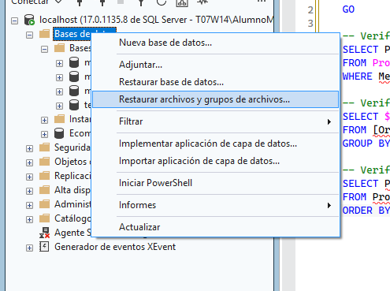
        
    - **Selecciona Dispositivo** y luego selecciona la puntería (**...**) para elegir un dispositivo.
    - Ahora dale a añadir en la Interfaz en la ruta donde alojaste tu `.bak`
    - Selecciona **OK** para confirmar tu selección de copia de seguridad de base de datos y cierra la ventana **Seleccionar dispositivos de copia** de seguridad
    - Antes de continuar revisa los archivos y ya luego dale a OK
        
        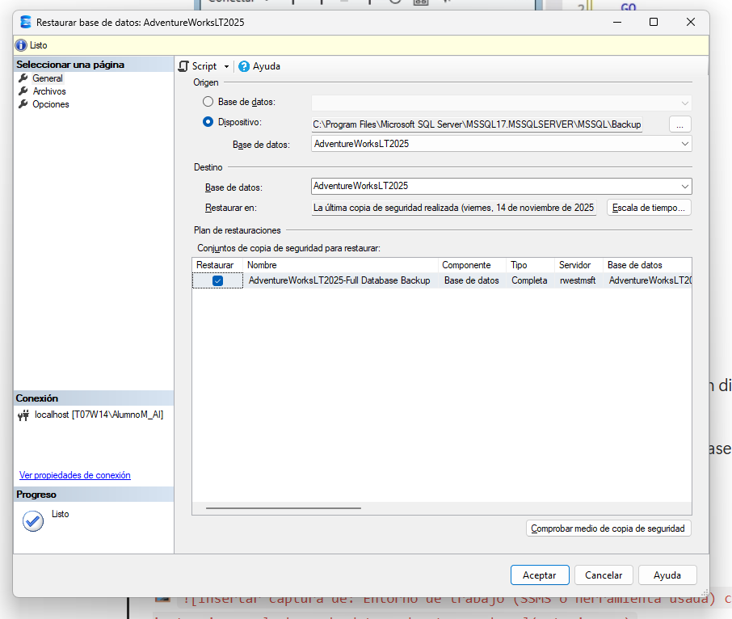
        

## 2. Desarrollo

### 2.1 Conexión a AdventureWorksLT

Verificación de la conectividad y de las tablas clave (`SalesLT.Customer`, `SalesLT.SalesOrderHeader`, `SalesLT.Product`).

```sql
-- Verify key tables in AdventureWorksLT
SELECT TOP (5) CustomerID, FirstName, LastName
FROM SalesLT.Customer;

SELECT TOP (5) SalesOrderID, OrderDate, CustomerID
FROM SalesLT.SalesOrderHeader;

SELECT TOP (5) ProductID, Name, ListPrice
FROM SalesLT.Product;
```

> Nos devuelve correctamente el top de los datos de las tres tablas seleccionadas en cada consulta
> 

> 
> 
> 
> 
> 

### 2.2 Creación de una vista para simplificar consultas

Vista que combina clientes y sus pedidos en AdventureWorksLT (esquema `SalesLT`), ocultando la complejidad del `JOIN` al código de la aplicación.

```sql
CREATE OR ALTER VIEW SalesLT.vCustomerOrders AS
SELECT
    c.CustomerID,
    CONCAT(c.FirstName, ' ', c.LastName) AS CustomerName,
    h.SalesOrderID,
    h.OrderDate
FROM SalesLT.Customer c
INNER JOIN SalesLT.SalesOrderHeader h ON c.CustomerID = h.CustomerID;
```

Validación de la vista:

```sql
SELECT TOP (5) *
FROM SalesLT.vCustomerOrders
ORDER BY OrderDate DESC;
```

> 
> 
> 
> 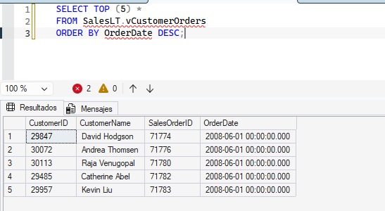
> 

### 2.3 Creación de un procedimiento almacenado para procesar un pedido

Procedimiento que añade una línea de pedido a un pedido existente en AdventureWorksLT y actualiza el subtotal de la cabecera.

```sql
CREATE OR ALTER PROCEDURE dbo.AddOrderLineItem
    @SalesOrderID INT,
    @ProductID    INT,
    @Quantity     INT
AS
BEGIN
    SET NOCOUNT ON;
    BEGIN TRANSACTION;

    -- Use Product ListPrice as UnitPrice
    DECLARE @UnitPrice DECIMAL(18,2);
    SELECT @UnitPrice = CAST(ListPrice AS DECIMAL(18,2))
    FROM SalesLT.Product
    WHERE ProductID = @ProductID;

    IF @UnitPrice IS NULL
    BEGIN
        ROLLBACK TRANSACTION;
        THROW 50010, 'Invalid ProductID specified.', 1;
    END

    -- Ensure SalesOrderID exists
    IF NOT EXISTS (SELECT 1 FROM SalesLT.SalesOrderHeader WHERE SalesOrderID = @SalesOrderID)
    BEGIN
        ROLLBACK TRANSACTION;
        THROW 50011, 'Invalid SalesOrderID specified.', 1;
    END

    -- Insert line item (no discount)
    INSERT INTO SalesLT.SalesOrderDetail (SalesOrderID, OrderQty, ProductID, UnitPrice, UnitPriceDiscount)
    VALUES (@SalesOrderID, @Quantity, @ProductID, @UnitPrice, 0);

    -- Update header subtotal based on current line totals
    UPDATE h
    SET SubTotal = d.SumLineTotal,
        ModifiedDate = SYSUTCDATETIME()
    FROM SalesLT.SalesOrderHeader h
    INNER JOIN (
        SELECT SalesOrderID, SUM(LineTotal) AS SumLineTotal
        FROM SalesLT.SalesOrderDetail
        WHERE SalesOrderID = @SalesOrderID
        GROUP BY SalesOrderID
    ) d ON d.SalesOrderID = h.SalesOrderID;

    COMMIT TRANSACTION;
END;
```

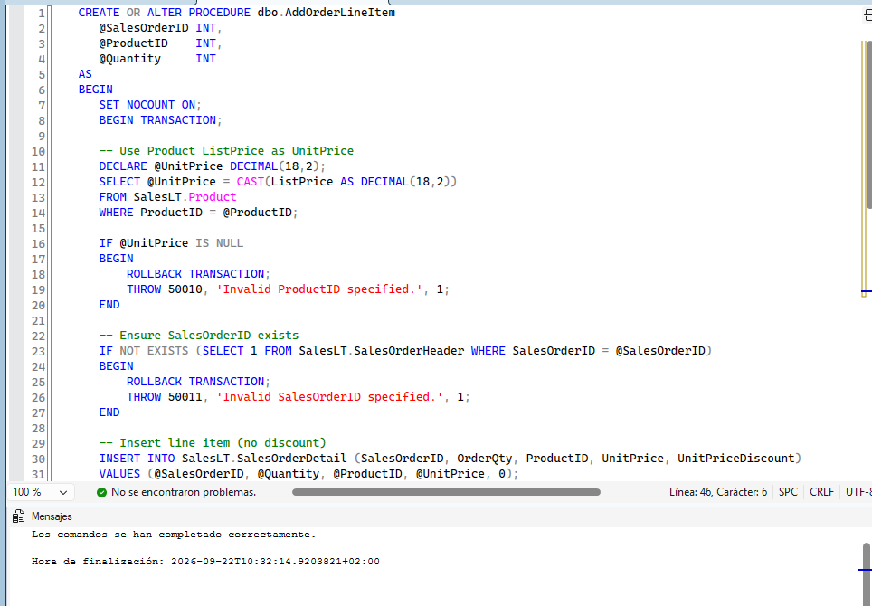

Prueba del procedimiento almacenado:

```sql
-- Add a line item to an existing order (choose a valid SalesOrderID)
DECLARE @SalesOrderID INT = (SELECT TOP 1 SalesOrderID
                             FROM SalesLT.SalesOrderHeader
                             ORDER BY SalesOrderID DESC);
EXEC dbo.AddOrderLineItem @SalesOrderID = @SalesOrderID,
                            @ProductID = 680,
                            @Quantity = 1; -- adjust ProductID as needed

SELECT TOP (5) *
FROM SalesLT.SalesOrderDetail
WHERE SalesOrderID = @SalesOrderID
ORDER BY SalesOrderDetailID DESC;

SELECT SalesOrderID, SubTotal, TaxAmt, Freight, TotalDue
FROM SalesLT.SalesOrderHeader
WHERE SalesOrderID = @SalesOrderID;
```

> 
> 
> 
> 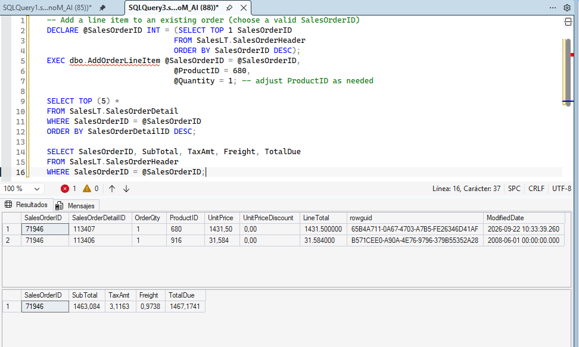
> 

### 2.4 Creación de una función escalar para cálculos reutilizables

Función escalar que devuelve el valor total de un pedido a partir de los importes de línea de AdventureWorksLT.

```sql
CREATE OR ALTER FUNCTION dbo.fnOrderTotal (@OrderID INT)
     RETURNS DECIMAL(18,2)
     AS
     BEGIN
        DECLARE @Total DECIMAL(18,2);

    SELECT @Total = SUM(LineTotal)
        FROM SalesLT.SalesOrderDetail
        WHERE SalesOrderID = @OrderID;

    RETURN ISNULL(@Total, 0.00);
     END;
```

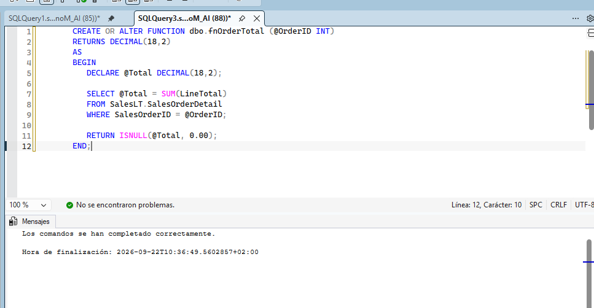

Uso de la función:

```sql
SELECT d.SalesOrderID, dbo.fnOrderTotal(d.SalesOrderID) AS OrderTotal
FROM SalesLT.SalesOrderDetail d
GROUP BY d.SalesOrderID
ORDER BY d.SalesOrderID DESC;
```

> 
> 
> 
> 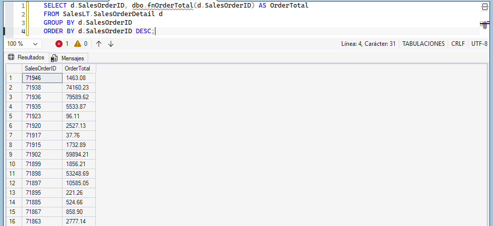
> 

### 2.5 Creación de una función de tabla en línea (TVF)

TVF que devuelve los pedidos de un cliente concreto de AdventureWorksLT, útil en cláusulas `SELECT` y `JOIN`.

```sql
CREATE OR ALTER FUNCTION dbo.GetCustomerOrders (@CustomerID INT)
RETURNS TABLE
AS
RETURN
(
    SELECT
        h.SalesOrderID,
        h.OrderDate
    FROM SalesLT.SalesOrderHeader h
    WHERE h.CustomerID = @CustomerID
);
```

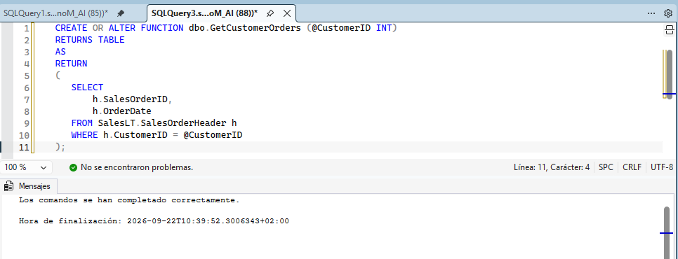

Consulta directa de la función:

```sql
SELECT *
FROM dbo.GetCustomerOrders(29929)
ORDER BY OrderDate DESC;
```

Uso de la función junto con `CROSS APPLY`:

```sql
SELECT CONCAT(c.FirstName, ' ', c.LastName) AS CustomerName, o.SalesOrderID, o.OrderDate
FROM SalesLT.Customer c
    CROSS APPLY dbo.GetCustomerOrders(c.CustomerID) o
WHERE c.CustomerID = 29929;
```

> Comprobación de la
> 

> 
> 
> 
> 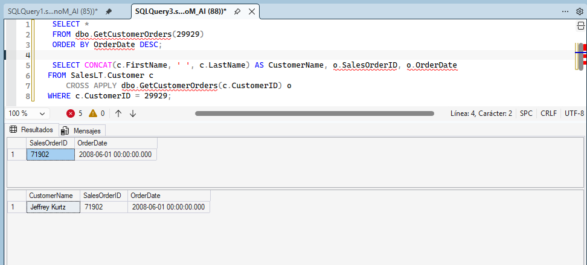
> 

### 2.6 Creación de un trigger para registrar cambios

Trigger que registra actualizaciones del total de un pedido cuando cambian los detalles de pedido en `SalesLT`.

```sql
-- Audit table
IF OBJECT_ID('dbo.OrderAudit') IS NULL
BEGIN
    CREATE TABLE dbo.OrderAudit (
        AuditID     INT IDENTITY(1,1) PRIMARY KEY,
        OrderID     INT NOT NULL,
        OldTotal    DECIMAL(18,2) NULL,
        NewTotal    DECIMAL(18,2) NULL,
        ChangedAt   DATETIME2 NOT NULL DEFAULT SYSUTCDATETIME()
    );
END
GO

-- Trigger on order details updates
CREATE OR ALTER TRIGGER SalesLT.trg_LogOrderTotalChange
ON SalesLT.SalesOrderDetail
AFTER INSERT, UPDATE
AS
BEGIN
    SET NOCOUNT ON;

    ;WITH AffectedOrders AS (
        SELECT SalesOrderID FROM inserted
        UNION
        SELECT SalesOrderID FROM deleted
    ),
    -- New totals from the base table (already reflects changes)
    NewTotals AS (
        SELECT d.SalesOrderID, SUM(d.OrderQty * d.UnitPrice) AS Total
        FROM SalesLT.SalesOrderDetail d
        INNER JOIN AffectedOrders a ON d.SalesOrderID = a.SalesOrderID
        GROUP BY d.SalesOrderID
    ),
    -- Contribution of the newly inserted/updated rows
    InsertedTotals AS (
        SELECT SalesOrderID, SUM(OrderQty * UnitPrice) AS Total
        FROM inserted
        GROUP BY SalesOrderID
    ),
    -- Contribution of the previous row versions (empty on INSERT)
    DeletedTotals AS (
        SELECT SalesOrderID, SUM(OrderQty * UnitPrice) AS Total
        FROM deleted
        GROUP BY SalesOrderID
    )
    INSERT INTO dbo.OrderAudit (OrderID, OldTotal, NewTotal)
    SELECT
        n.SalesOrderID,
        n.Total - ISNULL(i.Total, 0) + ISNULL(d.Total, 0) AS OldTotal,
        n.Total AS NewTotal
    FROM NewTotals n
    LEFT JOIN InsertedTotals i ON n.SalesOrderID = i.SalesOrderID
    LEFT JOIN DeletedTotals d ON n.SalesOrderID = d.SalesOrderID;
END;
```

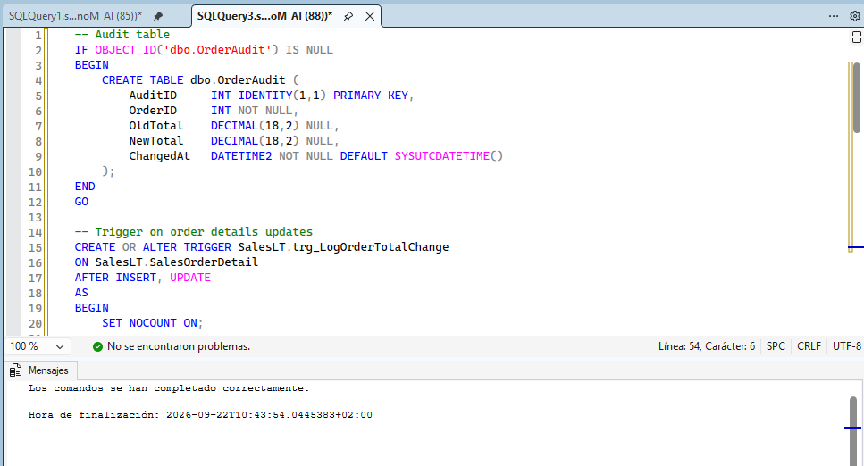

Prueba del trigger:

```sql
-- Update an order detail to change the total
UPDATE d
SET OrderQty = OrderQty + 1
FROM SalesLT.SalesOrderDetail d
WHERE d.SalesOrderID = (SELECT TOP 1 SalesOrderID FROM SalesLT.SalesOrderHeader ORDER BY SalesOrderID DESC);

SELECT TOP (5) *
FROM dbo.OrderAudit
ORDER BY AuditID DESC;
```

> El extracto devuelve las filas recientes de la tabla de auditoría. Cada fila muestra el que fue afectado, el total anterior (), el nuevo total () tras el cambio de cantidad y una marca de tiempo. Esto confirma que el disparador registró automáticamente la modificación.`SELECT OrderID OldTotal NewTotal`
> 

> 
> 
> 
> 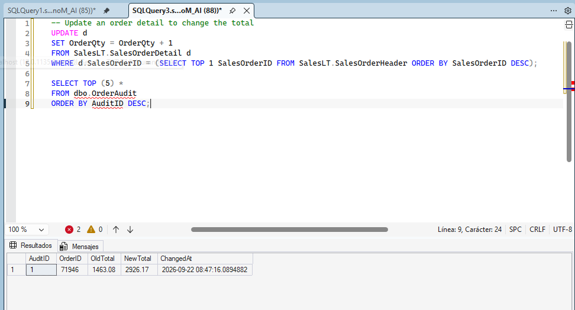
> 

## 3. Limpieza del entorno

> No se realiza limpieza del entorno puesto a que se necesitara la base de datos para las siguientes partes del laboratorio
> 

## 4. Resultados

> A lo largo del laboratorio se han realizado las consultas propuestas sobre la base de dados `AdventureWorksLT 2025`  de manera exitosa
> 

## 5. Referencias

- [Implement programmability objects with SQL – Lab Exercises (Microsoft Learn)](https://microsoftlearning.github.io/mslearn-sql-developer/Instructions/Labs/02-implement-programmability-objects.html)
- [AdventureWorks sample databases – Microsoft Learn](https://learn.microsoft.com/en-us/sql/samples/adventureworks-install-configure)